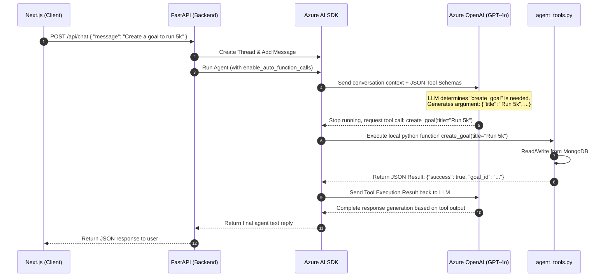

# Interview Preparation: AI Tool Calling & Agentic Workflows
This guide explains how **Tool Calling (Function Calling)** is implemented, configured, and executed within the **Solo-Leveling AI Agent** ecosystem, designed for AI Engineer and Agentic Systems interview questions.

---

## 1. The Tool Calling Lifecycle
When an LLM agent needs to perform an action outside of text generation (like querying a database or fetching stock data), it uses **Function Calling**. 

Here is how a single tool call flows through the system:



---

## 2. Defining Tools in Python
For an agent to understand a tool, the tool must have **strict type annotations** and a **detailed docstring**. The Azure AI SDK parses this metadata to compile the JSON schema sent to the LLM.

Here is a tool definition example:

```python
def create_goal(title: str, category: str = "personal", priority: str = "medium") -> str:
    """
    Create a new goal/objective for the current user.
    Use this when the user explicitly asks to add, create, or track a new goal.
    
    :param title: The title/name of the goal (e.g. 'Complete React course')
    :param category: The category, must be one of: productivity, learning, career, fitness, personal, work, health, finance
    :param priority: The priority of the goal, must be one of: low, medium, high
    :return: A JSON string indicating success or error details.
    """
    try:
        user_email = get_user_email() # Thread-local state retrieval
        _validate_user_access()
        
        # Async call mapped inside synchronous context
        result = _run_async(GoalService.create_goal(user_email, {
            "title": title,
            "category": category,
            "priority": priority,
            "status": "active",
            "progress": 0
        }))
        return json.dumps(result)
    except Exception as e:
        return json.dumps({"success": False, "error": str(e)})
```

---

## 3. Configuring and Enabling Tools
To link these python functions to the Azure AI Agent execution loop, we use `enable_auto_function_calls`.

Here is the setup in `llm_service.py` and `app.py`:

```python
from agent_tools import get_stock_history, get_user_goals, create_goal, delete_goal, get_news_by_category

# Link functions to the client (Azure AI SDK handles schema parsing and routing)
llm_service.project_client.agents.enable_auto_function_calls(
    tools={get_stock_history, get_user_goals, create_goal, delete_goal, get_news_by_category},
    max_retry=5
)
```

When we invoke the run:
```python
run = llm_service.project_client.agents.runs.create_and_process(
    thread_id=thread_id,
    agent_id=agent_id
)
```
The SDK automatically intercepts the LLM's tool-call requests, resolves them to the registered python functions, runs them, forwards the results back to the LLM, and resumes processing without manual developer intervention.

---

## 4. Interview Scenarios: Questions & Answers

### Q1: "How does an LLM actually execute a Python function? Does the model run the code?"
* **Answer Script**:
  > *"No, the LLM does not execute code. The process is entirely schema-driven:*
  > 1. *During the API call, we send the LLM a list of 'Tools' formatted as JSON schemas (defining the function name, description, parameters, and types).*
  > 2. *The model reads the user's prompt and decides if any tool schema matches the user's intent. If so, it halts normal generation and outputs a structured request to call that function, specifying the function name and parsed JSON arguments.*
  > 3. *Our local runtime (the Azure AI SDK inside FastAPI) receives this request, finds the matching Python function, executes it locally, and sends the return value back to the LLM as a 'tool' message.*
  > 4. *The LLM reads the tool output and continues generating text based on the real-world data returned."*

### Q2: "How do you handle security and user scoping in agentic tool calls? If the model makes the call, how does it know which user it is calling for?"
* **Answer Script**:
  > *"This is a critical security vector in agentic design. Since the LLM is untrusted and can be subject to prompt injections, we do not allow the LLM to pass the user's identity (like user_id or email) as a function parameter.*
  > *Instead, we store the authenticated user's email in thread-local storage (`set_user_email(user_email)`) at the start of the request. When the LLM decides to trigger a tool, the local Python function executes in that same request thread and fetches the email from the secure thread-local state. This ensures that even if the user prompts the model to 'delete goals for bob@gmail.com', the tool execution will only modify goals matching the caller's authenticated context."*

### Q3: "What happens if a tool fails during execution? How does your agent handle retries and error propagation?"
* **Answer Script**:
  > *"We configure our tool calling with `max_retry=5` in the Azure AI SDK. If a Python tool throws an exception, our helper catches it and returns a JSON error string (e.g. `{'success': false, 'error': 'Database timeout'}`) directly to the LLM.*
  > *This allows the LLM to observe the failure. In many cases, if it's a minor validation error, the LLM will adjust the arguments and retry the call. If the error persists, the LLM incorporates the error details into its final text response to inform the user cleanly, rather than crashing the server."*
