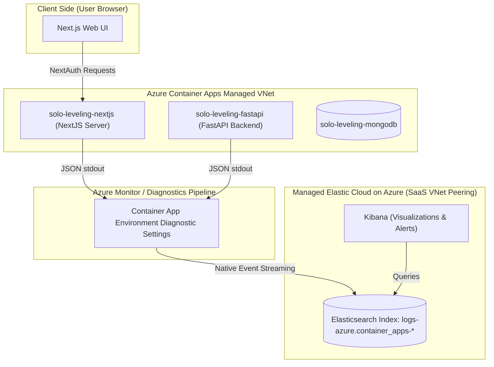

# Observation and Observability Guide: Elasticsearch, Kibana, & Azure Observability
This document is designed to help you prepare for AI Engineering, Cloud Architecture, and DevOps interviews, explaining every decision, design pattern, and trade-off in the integration of Elasticsearch and Kibana with the Solo-Leveling application.

---

## 1. Observability Architecture & Log-Shipping Flow
To maintain enterprise-grade reliability and low latency, we deploy the following pipeline:



### Architectural Decisions & Rationale:
1. **Log Format: Elastic Common Schema (ECS)**:
   * Both Next.js and FastAPI log in structured JSON aligning with ECS namespaces (e.g. `log.level`, `service.name`, `transaction.id`, `http.request.method`).
   * *Rationale*: Standardization ensures Kibana can automatically parse request-logs, errors, and traces across different services without needing custom Grok filters.
2. **Log Shipper: Native Azure Diagnostics Ingress (No Filebeat/Agent Sidecars)**:
   * The applications print JSON records directly to standard output (`stdout`/`stderr`). The Azure Container Apps Environment captures these console lines. A Diagnostic Setting on the ACA Environment streams them directly to the Azure Native Elastic resource.
   * *Rationale*: Avoids running Filebeat or Fluentbit as sidecar containers. Sidecars consume CPU and memory, increase cold-start latency, and complicate Docker Compose local parity. Console streaming keeps the runtime serverless.

---

## 2. Structured Log Schema (FastAPI & Next.js)
Both services output consistent JSON schemas. Here is how they represent logs:

### API Request Schema (ECS-Aligned):
```json
{
  "@timestamp": "2026-06-10T19:24:45.123Z",
  "log.level": "info",
  "message": "Responded HTTP 200 in 45.2ms",
  "service": {
    "name": "solo-leveling-fastapi",
    "version": "1.0.0",
    "environment": "production"
  },
  "transaction": {
    "id": "761be57c-f23b-483d-ac70-349c8929dc6a"
  },
  "user": {
    "id": "e3b0c44298fc1c14" 
  },
  "http": {
    "request": {
      "method": "GET",
      "referrer": "/goals"
    },
    "response": {
      "status_code": 200
    }
  },
  "latency_ms": 45.2,
  "event": {
    "created": "2026-06-10T19:24:45.123Z",
    "duration": 45200000
  }
}
```
*Note: `user.id` is a truncated SHA-256 hash of the user's email address (e.g. `hashlib.sha256(email).hexdigest()[:16]`). Raw PII is completely excluded.*

### AI Tool Calling Schema:
```json
{
  "@timestamp": "2026-06-10T19:25:06.789Z",
  "log.level": "info",
  "message": "Tool execution completed. Result length: 142",
  "service": {
    "name": "solo-leveling-fastapi",
    "version": "1.0.0",
    "environment": "production"
  },
  "transaction": {
    "id": "761be57c-f23b-483d-ac70-349c8929dc6a"
  },
  "tool_name": "get_stock_history",
  "latency_ms": 112.5
}
```

---

## 3. Kibana Dashboards Blueprint
To demonstrate operational maturity in an interview, you should design and walk through these three dashboard groups:

### Dashboard A: API Health (Core Web Analytics)
* **Goal**: Measure availability and responsiveness.
* **Panels**:
  1. **HTTP Status Codes Distribution**: Bar chart showing 2xx, 3xx, 4xx, and 5xx response ratios.
  2. **Error Rate Gauge**: Metric panel measuring `http.response.status_code >= 500 / total_requests` with a target threshold of `< 0.1%`.
  3. **Response Time Percentiles**: Line chart displaying P50, P95, and P99 latency trends (filter using `latency_ms`).
  4. **Top 5 Failing Routes**: Data table sorting routes by 5xx status counts to isolate route bugs.
  5. **Authentication Failures**: Line chart displaying `http.response.status_code: 401` over time to monitor brute force or token expiry events.

### Dashboard B: AI Operations (Agent Performance)
* **Goal**: Analyze the cost, responsiveness, and accuracy of AI systems.
* **Panels**:
  1. **AI Chat Requests volume**: Area chart measuring incoming chat runs over time.
  2. **Tool Invocation Frequency**: Horizontal bar chart of `tool_name` occurrences to evaluate which tasks are requested most.
  3. **Agent response Latency (End-to-End)**: Line chart displaying average LLM response latency.
  4. **Tool Execution Failures**: Pie chart grouping `error_type` where `tool_name` exists, to find buggy python schemas.
  5. **Model Ingestion cost (Simulated)**: Gauge measuring tokens consumed (input + output) mapping to estimated costs.

### Dashboard C: User & System Operations (State Monitoring)
* **Goal**: Detect database leaks, third-party limits, and user adoption.
* **Panels**:
  1. **MongoDB Failure Metrics**: Metric indicator mapping `mongodb_failure: true` count.
  2. **External API Failures**: Visual alerts showing failures to Yahoo Finance or NewsAPI.
  3. **Exception Breakdown**: Bubble chart of backend exceptions grouped by `error.type` and `error.message`.
  4. **Active Hunter Logins**: Stat panel displaying unique `user.id` hashes interacting with the dashboard.

---

## 4. Security, Secrets, and Governance Model
1. **Secrets Isolation**:
   * All API keys (e.g. `ELASTICSEARCH_API_KEY`, `NEWS_API_KEY`, `GOOGLE_CLIENT_SECRET`) are stored in **Azure Key Vault** (`Microsoft.KeyVault/vaults`).
   * Azure Container Apps authenticate to Key Vault via **System-Assigned Managed Identities** (no connection string inside the container configurations).
2. **Kibana Access Control**:
   * Kibana is configured behind **Single Sign-On (SSO)** mapped to Microsoft Entra ID (formerly Azure Active Directory).
   * **RBAC Policies**:
     * `Admin/Observability Team`: Roles mapped to read/write dashboards, configure index mappings, and set alerts.
     * `Developers/Support`: Read-only access to specific dashboards with no privileges to edit index life-cycles.
3. **Logs Sanitization (PII Protection)**:
   * Emails are parsed and turned into non-reversible SHA-256 hashes inside memory before logs are serialized.
   * Parameter values from tool calls (like stock symbols or categories) are logged, but raw input messages, prompts, and database passwords are regex-filtered to remove emails, phone numbers, and keys.

---

## 5. Master Interview Prep Sheet

### Q1: "Why managed Elastic on Azure instead of a self-hosted ELK stack on a VM?"
* **Answer**: 
  > *"Self-hosting Elasticsearch, Logstash, and Kibana on virtual machines introduces significant operational overhead. We have to configure clustering, handle JVM memory tuning, manage disk provisioning for indexing, configure SSL certs manually, and handle upgrades.*
  > *By choosing Managed Elastic on Azure (Azure Native Elastic Integration), we get a production-ready, SaaS-managed instance. Azure handles node provisioning, backup snapshots, scaling, and Kibana availability, while billing is unified directly within our Azure subscription. This allows our team to focus on application logic and dashboard engineering rather than infrastructure maintenance."*

### Q2: "How did you design your logging architecture to avoid blocking user threads or backend requests?"
* **Answer**:
  > *"We utilized a console-streaming (stdout) approach combined with async request logging. Inside FastAPI, the `loguru` logger prints structured JSON to stdout.*
  > *Because printing to stdout is a fast, non-blocking operation, the user's thread is never slowed down by network round-trips to Elasticsearch. The logs are captured asynchronously at the hypervisor/host level by Azure Container Apps' background agents and forwarded via Diagnostic Settings to the Elastic Monitor. If Elasticsearch is temporarily unavailable, the application continues running normally without memory leaks or request timeouts."*

### Q3: "Observability and privacy are often in conflict. How did you ensure compliance with privacy regulations (like GDPR) in your logs?"
* **Answer**:
  > *"We built privacy-first logging directly into our orchestration layers. Inside both Next.js and FastAPI, we intercept user details and run them through a SHA-256 hashing utility before they hit the console, producing a static 16-character identifier. This allows us to track unique active users and correlate their request pathways without ever storing raw email addresses or personal names in plain text inside Elasticsearch.*
  > *Furthermore, we do not log full raw prompt inputs or database document payloads, shielding potential sensitive notes from developers reading Kibana charts."*

### Q4: "How would you scale this architecture to handle 10,000 requests per second?"
* **Answer**:
  > *"At high scale, diagnostic log forwarding directly from ACA to Elastic can become a bottleneck or incur high costs. We would scale this by introducing a buffer queue:*
  > 1. *ACA streams logs to an **Azure Event Hub** (which acts as a high-throughput queue like Kafka).*
  > 2. *An **Elastic Integration Agent** or a **Logstash Cluster** consumes logs asynchronously from the Event Hub, batches them, and writes them via bulk API calls to Elasticsearch.*
  > 3. *Inside Elasticsearch, we would configure an **Index Lifecycle Management (ILM)** policy, automatically rolling logs into 'warm' and 'cold' storage tiers after 7 days, and deleting logs older than 30 days to optimize storage costs."*
