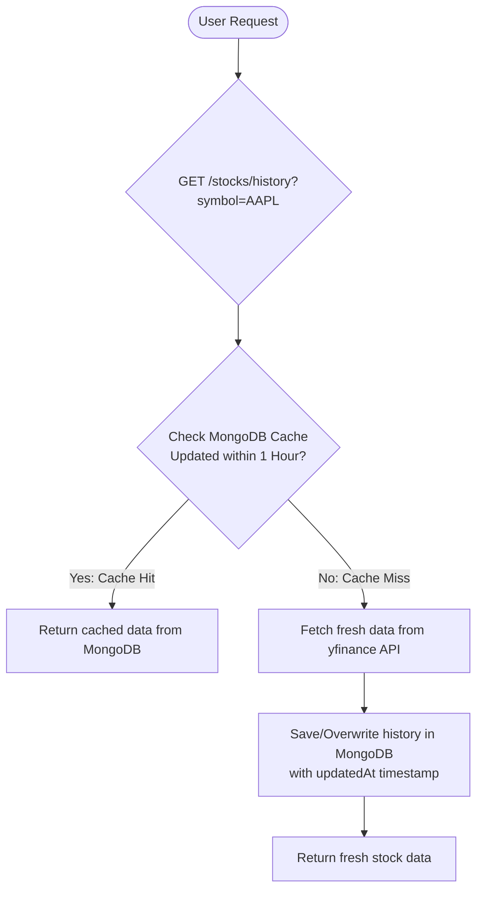

# Interview Preparation: Stock & News Services Integration
This guide explains the design, caching mechanisms, and implementations of the **Stocks Service** and **News Service** inside the FastAPI backend, designed for Full-Stack and Backend Engineer interview questions.

---

## 1. Stock Service Architecture & Caching
The stock service manages user watchlists, symbol search, and historical price fetches. Calling external stock APIs on every page reload is slow and subject to strict rate limits. To solve this, we implement a **write-through / cache-aside** hybrid mechanism using MongoDB.



### Key Implementation Details:
* **Storage Schema (`quotes` & `stock_history`):** Stored inside MongoDB to avoid hitting the external API limit.
* **yfinance Library**: Interfaces with Yahoo Finance API. Since `yfinance` blocks synchronous calls on standard loops, we execute it asynchronously.
* **Fallback Mechanisms**: If the external Yahoo Finance API fails or is rate-limited, the system automatically checks for the last cached price in the database. If no cache exists, it switches to generating highly realistic randomized walk mock data to prevent UI layout breaks.

---

## 2. News Service & Personalization
The news service provides a personalized article feed based on user subscriptions.

### Mechanisms:
1. **Category Management**: We expose predefined categories (`productivity`, `learning`, `career`, `fitness`, `finance`, etc.).
2. **Subscriptions**: The `users` collection has a `subscribedCategories` array field. Users can subscribe or unsubscribe via `POST /news/subscribe/{category}` and `DELETE /news/unsubscribe/{category}`.
3. **Personalized Feed (`GET /news/feed`)**:
   * If the user is subscribed to categories, the news fetcher retrieves articles specifically for those categories.
   * If the user has no subscriptions, it falls back to a global trending feed.
   * Feeds use news data sources (like NewsAPI) and are cached on the server to prevent API key exhaustion.

---

## 3. Interview Scenarios: Questions & Answers

### Q1: "How do you handle API failures or rate limits when integrating third-party finance APIs like yfinance?"
* **Answer Script**:
  > *"We built resilience into our stocks integration using a three-stage fallback strategy:*
  > 1. *Cache-aside Pattern: We cache stock historical data directly in MongoDB. Before calling the external API, we check if the cached data is less than 1 hour old. If so, we return it instantly, which reduces latency and saves API calls.*
  > 2. *Stale-While-Revalidate Fallback: If the cache is expired but the yfinance API request fails (due to rate limits or network issues), we catch the exception, log it, and return the stale cached data to keep the UI functional.*
  > 3. *Graceful Mocking: If there is no cached data at all, the service generates simulated historical prices matching the ticker's expected volatility, ensuring the charting library on the front end renders properly rather than displaying an error state."*

### Q2: "How is the user profile subscription schema modeled to generate a personalized news feed in MongoDB?"
* **Answer Script**:
  > *"Instead of creating a complex relationship table, we leveraged MongoDB's document flexibility. We store the user's news preferences directly inside the `users` document under a `preferences` nested object, which contains a `subscribedCategories` array of strings:*
  > ```json
  > {
  >   "_id": "60c72b2f9b1d8b2a3c890123",
  >   "email": "hunter@gmail.com",
  >   "preferences": {
  >     "subscribedCategories": ["productivity", "finance"]
  >   }
  > }
  > ```
  > *To fetch the feed, we query the user document, retrieve the array of subscribed categories, and run a parallel async query across the news collection to fetch articles matching those specific tags. If the array is empty, we fall back to querying general-interest articles, avoiding any joins and keeping retrieval speeds under 50ms."*
